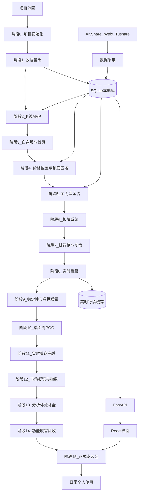

# 个人看盘桌面应用开发路线图

版本：v1.0  
日期：2026-07-03  
定位：从 MVP 到私人桌面应用的完整开发流程

---

## 产品方向

构建一个供个人使用的 A 股看盘与复盘桌面应用。该应用**不支持**券商登录、下单、自动交易、账户凭证存储，也不对外提供商业行情数据服务。

建议先做成**本地 Web 应用**，因为开发、测试、调试更快；等核心分析流程稳定后，再打包成私人桌面应用。

推荐最终技术形态：

- 前端：React + TypeScript + Vite
- 图表：K 线与成交量用 TradingView Lightweight Charts；排行榜、资金流等可用 ECharts
- 后端：Python + FastAPI + Pandas
- 存储：MVP 与个人桌面版均使用 SQLite
- 数据源：优先 AKShare，pytdx / Tushare 作为补充或备用
- 实时行情：先做 1–3 秒级报价轮询与 1 分钟 K / 分时图，后续如需要再评估 tick / Level-2 付费数据源
- 桌面打包：**功能完善后再做正式 installer**；Stage 10 Electron POC 已完成，仅作参考；日常开发继续用本地 Web 应用

---

## 端到端工作流

---

## 阶段 0：项目基础

**目标**：搭建项目骨架，验证前后端能正常通信。

**具体工作**：

- 创建 `backend/`、`frontend/`、`data/` 目录结构
- 初始化 FastAPI 后端，提供健康检查接口
- 初始化 React + Vite 前端
- 配置 SQLite 连接与基础配置加载
- 前端添加简单 API 客户端
- 确认前端能调用本地后端接口

**验收标准**：

- 后端可在本地启动
- 前端可在本地启动
- 前端能显示后端测试接口返回的数据

---

## 阶段 1：数据基础

**目标**：在构建复杂 UI 之前，先建立可靠的本地数据采集与存储。

**具体工作**：

- 使用 AKShare 获取股票列表与日 K 数据
- 规范化股票代码、交易所、日期、价格、成交量、成交额
- 股票基础信息存入 `stocks` 表
- 日 K 数据存入 `kline_daily` 表
- 实现 repository / service 层，避免 API 与采集器直接依赖 AKShare 原始字段
- 为指定股票提供手动刷新命令或接口

**验收标准**：

- 常见股票代码可拉取并本地存储
- 重复刷新能正确更新或跳过已有数据
- 后端可返回本地缓存的 K 线数据

---

## 阶段 2：K 线 MVP

**目标**：做出第一个真正可用的页面——搜索股票并查看日 K 与成交量。

**具体工作**：

- 实现按代码、名称搜索股票
- 实现 `/api/stocks/{code}/kline`
- 构建 `StockDetail` 个股详情页
- 添加 K 线蜡烛图
- 添加与 K 线时间轴对齐的成交量图
- 显示最新价、涨跌幅、成交量、成交额等基础信息

**验收标准**：

- 搜索 `600519` 或股票名称可进入个股详情页
- 日 K 与成交量正确渲染
- 图表支持缩放、拖动、十字光标

---

## 阶段 3：自选股与首页 Dashboard

**目标**：让应用变成每天开盘/复盘时真正会打开的工具。

**具体工作**：

- 添加 `watchlist` 表
- 实现自选股添加、删除、排序 API
- 构建自选股页面与首页 Dashboard
- 展示主要指数、自选股涨跌幅、成交额、最近更新时间
- 初期先用手动刷新，降低复杂度

**验收标准**：

- 可维护个人自选股列表
- 首页能在约 30 秒内掌握市场与自选股状态
- 不需要每次都手动输入股票代码

---

## 阶段 4：价格位置与顶底区域

**目标**：实现第一个核心分析功能。

**具体工作**：

- 实现价格位置公式：`(close - rolling_low) / (rolling_high - rolling_low) * 100`
- 支持 250、750、1250 交易日窗口
- 划分区域：深度底部、底部观察、中性、高位观察、顶部风险
- 添加 `/api/stocks/{code}/position`
- 先在副图展示 0–100 位置分数
- 在个股详情与自选股列表中显示标签
- 分数副图稳定后，再增加 K 线背景染色

**验收标准**：

- 每只已缓存股票都有 0–100 价格位置分数
- 个股详情页清晰显示当前区域
- 自选股列表显示高位 / 中性 / 低位标签

---

## 阶段 5：主力资金流

**目标**：实现第二个核心分析功能。

**具体工作**：

- 优先使用 AKShare / 东方财富相关资金流接口
- 每日资金流存入 `moneyflow_daily` 表
- 包含数据来源与目标类型字段，使个股、板块、指数共用一致模型
- 实现个股资金流 API
- 在 K 线下方展示红绿资金流柱状图
- 第一版先做主力净流入、主力净占比
- 后续再加大单、超大单、中单、小单及 3/5/10 日累计线

**验收标准**：

- 个股详情页显示每日主力流入/流出柱
- 柱图日期与 K 线对齐
- 界面明确标注数据来源，并说明资金流为数据商衍生指标

---

## 阶段 6：板块系统

**目标**：支持「大盘 → 板块 → 个股」联动分析。

**具体工作**：

- 获取行业 / 概念板块列表
- 获取板块成分股
- 存储板块与成分股关系
- 添加板块详情页
- 展示板块 K 线（如数据源支持）
- 展示板块资金流与成分股排序
- 板块页可跳转至个股页

**验收标准**：

- 可查看主要板块及成分股
- 可识别资金流入较强的板块
- 可从板块分析进入个股分析

---

## 阶段 7：排行榜与每日复盘

**目标**：提高每日复盘效率。

**具体工作**：

- 添加涨幅榜、跌幅榜、成交额榜、换手率榜
- 添加主力净流入榜、主力净流出榜
- 添加板块涨幅榜、板块资金流榜
- 添加自选股复盘摘要
- 构建每日复盘页，回答：市场位置、强势板块、弱势板块、资金方向、自选股高低位

**验收标准**：

- 每日复盘比手动浏览多个外部网站更快
- 排行榜有助于识别市场热点与资金方向

---

## 阶段 8：实时看盘

**目标**：在核心分析流程稳定后，加入接近通达信体验的盘中实时观察能力，包括秒级报价刷新、分时图、分钟 K、自选股快刷。

**功能边界**：

- 目标是个人看盘，不是交易终端
- 不接券商账户，不下单，不做自动交易
- 第一版追求“接近实时”，不是交易所 tick 级严格实时
- 免费数据源不稳定时，优先保证当前打开个股和自选股，而不是全市场秒刷

**具体工作**：

- 新增 `realtime_quote_collector.py`，负责盘中实时报价采集
- 新增或扩展 `intraday_kline_collector.py`，支持 1 / 5 / 15 / 30 / 60 分钟 K
- 优先评估 `pytdx`、AKShare 实时行情接口、东方财富公开接口等数据源
- 新增实时行情缓存层，第一版可用内存缓存，后续如需要再考虑 Redis
- 新增实时报价 API，例如 `/api/stocks/{code}/quote/live`
- 新增分钟 K API，例如 `/api/stocks/{code}/kline?period=1m`
- 新增 WebSocket 或 SSE 推送通道，用于当前打开个股和自选股的盘中刷新
- 前端增加周期切换：日 K / 1 分 / 5 分 / 15 分 / 30 分 / 60 分
- 前端增加分时图，展示价格走势、均价线、成交量
- 自选股列表增加 1–3 秒级报价刷新能力
- 非交易时段自动停止实时任务，只读取历史缓存

**建议刷新策略**：

- 当前打开个股：1–3 秒刷新或推送
- 自选股列表：3–10 秒刷新
- 主要指数：3–10 秒刷新
- 全市场排行榜：30–60 秒刷新
- 分钟 K：按对应周期更新，当前分钟可动态刷新

**数据存储策略**：

- 历史日 K 继续写入 SQLite
- 分钟 K 可写入 `kline_intraday`，但需要控制保留周期
- 盘中最新报价优先放缓存，不必每秒写数据库
- 收盘后可将当日分钟 K 或关键快照落库

**验收标准**：

- 个股详情页可看到接近实时的最新价、涨跌幅、成交量、成交额
- 个股详情页支持 1 分钟 K 和分时图
- 自选股列表能自动刷新当前报价
- 前端图表可在不刷新页面的情况下更新
- 数据源异常时 UI 显示清楚，不影响历史 K 线和已有分析功能

---

## 阶段 9：稳定性与数据质量

**目标**：让应用适合个人日常使用。

**具体工作**：

- 添加数据源适配层，隔离原始字段
- 对关键数据类型增加备用数据源
- 采用本地缓存优先的查询策略
- 添加更新日志与可见的最后更新时间
- 校验缺失日期、重复行、异常空响应
- 为指标计算与数据规范化添加针对性测试

**验收标准**：

- 数据源故障不会导致整个应用崩溃
- UI 能明确显示数据过期或缺失
- 指标计算可复现、可解释
- 实时行情异常不会影响历史 K 线、自选股、价格位置、资金流等核心功能

---

## 阶段 10：桌面壳 POC（已完成）

**目标**：验证 Electron 桌面壳可行性，不作为正式安装包。

**当前状态**：

- `desktop/` 子项目已存在；
- 可加载 `frontend/dist` 并自动启动 FastAPI；
- 仍依赖开发仓库 `.venv`，不是 installer。

**策略（2026-07-08）**：POC 保留；正式打包延后到阶段 15。

---

## 阶段 11：实时看盘体验完善

**目标**：补齐分钟 K 缓存、分时 fallback 等 Path B 遗留项。

**任务**：

- 分钟 K 短 TTL 缓存；
- 分时图备用数据源；
- 盘中观察文案与数据源标注；
- 继续优化自选股快刷与 Dashboard 缓存行为。

**验收标准**：

- 切周期流畅，单一数据源失败可降级；
- 不影响历史分析功能。

---

## 阶段 12：市场概览与指数

**目标**：Dashboard 打开即看大盘。

**任务**：

- 主要指数卡片；
- 涨跌家数、成交额概览；
- 指数价格位置（如数据源允许）。

**验收标准**：

- Dashboard 具备大盘视角；
- 局部失败不拖垮整页。

---

## 阶段 13：分析体验补全

**目标**：补齐价格位置、板块分析等可视化遗留项。

**任务**：

- 250 / 750 / 1250 窗口 UI 切换；
- K 线区域染色或副图；
- 板块 K 线、板块资金流图；
- 视情况扩展概念 / 地域板块。

**验收标准**：

- 板块页具备 K 线与资金流观察能力；
- 仍明确为非交易信号。

---

## 阶段 14：功能收官与稳定性验收

**目标**：打包前最后一轮回归与验收。

**任务**：

- 全链路手动 / 自动测试；
- 数据源韧性复查；
- 文档与 no-trading 边界确认。

**验收标准**：

- Stage 11–13 清单全部完成；
- 测试与 build 通过。

---

## 阶段 15：正式桌面安装包

**目标**：功能完善后交付可双击使用的私人桌面应用。

**前置条件**：阶段 11–14 全部完成。

**推荐方案**：

- 保持 React 前端 + FastAPI 后端架构；
- 使用 Electron + `electron-builder`（POC 已验证 Electron 路径）；
- Python 后端打包为 sidecar；
- SQLite 放在应用数据目录；
- 个人使用采用「重打 installer + 覆盖安装」更新，不必先做自动更新。

**具体工作**：

- 构建前端生产资源并打入 Electron；
- 将后端打包为本地可执行 sidecar；
- 桌面应用启动时自动启动本地后端；
- 迁移 SQLite 到 app data；
- 添加本地设置：数据路径、刷新行为；
- 构建 macOS / Windows 安装包供个人使用。

**验收标准**：

- 双击桌面应用即可打开平台；
- 正常使用无需打开终端；
- 本地 SQLite 数据在应用重启后保留；
- 应用保持私人属性，不包含交易或账户功能。

---

## 建议开发顺序（按阶段）

| 阶段 | 内容 | 状态 |
|------|------|------|
| 0–9 | 基础 MVP、板块、排行榜、稳定性 | 已完成 |
| 10 | Electron 桌面壳 POC | 已完成 |
| 11 | 实时看盘体验完善 | 已完成 |
| 12 | 市场概览与指数 | 已完成 |
| 13 | 分析体验补全 | 已完成 |
| 14 | 功能收官验收 | **当前重点** |
| 15 | 正式 desktop installer | 功能完善后执行 |

---

## 需要保持稳定的关键决策

- 定位为**个人分析工具**，不是交易工具
- 先手动刷新，再考虑定时刷新
- 历史数据本地缓存
- 数据源适配层与业务逻辑分离
- 顶底功能命名为「价格位置」或「风险区域」，而非买卖信号
- 实时看盘第一版以 1–3 秒级报价和 1 分钟 K 为目标，不承诺交易所 tick 级实时
- tick / Level-2 级数据放在后续增强中评估，通常需要付费数据源
- AI、新闻、财务、回测、预警等功能延后，等核心流程稳定后再做

---

## 主要风险

- 免费数据源可能变更或失效
- 不同平台的主力资金流口径不一致
- 顶底指标可能被误解为预测工具
- 秒级实时行情对免费数据源压力较大，可能出现延迟、限流或字段变化
- 真 tick / Level-2 行情通常需要付费数据源或专业接口
- Python 后端桌面打包可能需要额外处理
- MVP 未稳定前功能膨胀会导致核心功能迟迟不可用

---

## 推荐的第一实现目标

先做一个本地 MVP，能够：

1. 拉取并存储一只 A 股的日 K 数据
2. 在前端展示 K 线与成交量
3. 计算并显示 250 日价格位置分数

再沿同一路径扩展：搜索、自选股、资金流、板块、**功能补全（Stage 11–14）**，最后才是 desktop installer（Stage 15）。

---

## 待办清单（与英文计划对应）

| ID | 内容 | 状态 |
|----|------|------|
| foundation | 搭建仓库、后端、前端、SQLite 与健康检查通信 | 已完成 |
| kline-mvp | 拉取、存储、提供并渲染个股日 K 与成交量 | 已完成 |
| watchlist-dashboard | 股票搜索、自选股管理、每日 Dashboard | 已完成（指数概览待 Stage 12） |
| position-indicator | 价格位置分数与顶底区域可视化 | 部分完成（窗口切换/K 线染色待 Stage 13） |
| moneyflow | 个股与板块资金流采集、存储、API 与图表 | 部分完成（板块资金流图待 Stage 13） |
| sector-ranking | 板块页、排行榜、每日复盘流程 | 已完成 |
| realtime-market-watch | 秒级报价、分钟 K、分时图、自选股盘中快刷 | 部分完成（缓存/fallback 待 Stage 11） |
| desktop-poc | Electron 桌面壳概念验证 | 已完成 |
| watch-polish | 分钟 K 缓存、分时 fallback、盘中体验完善 | 已完成 |
| market-overview | Dashboard 指数与市场概览 | 已完成 |
| analysis-polish | 价格位置 UI、板块 K 线、板块资金流图 | 已完成 |
| pre-pack-qa | 打包前稳定性与全链路验收 | **当前重点** |
| desktop-packaging | 正式 installer（Python sidecar + app data SQLite） | 功能完善后执行 |
